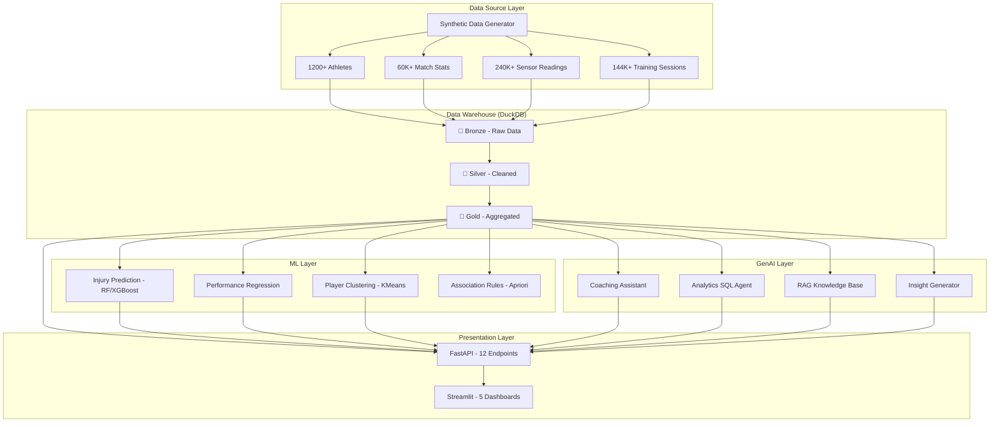

# 🏟️ Athlete Performance Analytics & Injury Risk Prediction Platform

> AI-powered platform that analyzes athlete data, predicts injury risks, scores player performance, and generates coaching recommendations — modeled after analytics used by Manchester City, FC Barcelona, and IPL franchises.


---

## 🏗️ Architecture



---

## 📂 Project Structure

```
Kenexai-athlete/
├── data/
│   ├── raw/                    # Generated parquet files
│   ├── athlete_warehouse.duckdb # DuckDB warehouse
│   └── chromadb/               # Vector store
├── models/                     # Trained ML models (.joblib)
├── src/
│   ├── data_generation/        # Synthetic data generators
│   │   ├── generate_athletes.py
│   │   ├── generate_match_stats.py
│   │   ├── generate_sensor_data.py
│   │   ├── generate_training_data.py
│   │   ├── stream_simulator.py
│   │   └── run_all.py
│   ├── warehouse/
│   │   └── schema.py           # DuckDB medallion + star schema
│   ├── etl/
│   │   ├── etl_pipeline.py     # Bronze → Silver → Gold ETL
│   │   └── data_quality.py     # Quality profiling
│   ├── ml/
│   │   ├── injury_prediction.py
│   │   ├── performance_prediction.py
│   │   ├── player_clustering.py
│   │   ├── association_rules.py
│   │   └── train_all.py
│   ├── genai/
│   │   ├── coaching_assistant.py
│   │   ├── analytics_agent.py
│   │   ├── rag_system.py
│   │   └── insight_generator.py
│   ├── api/
│   │   └── main.py             # FastAPI backend
│   └── dashboard/
│       ├── app.py              # Streamlit entry point
│       └── pages/
│           ├── 1_Data_Quality.py
│           ├── 2_Player_Performance.py
│           ├── 3_Injury_Risk.py
│           ├── 4_Team_Analytics.py
│           └── 5_AI_Insights.py
├── requirements.txt
├── Dockerfile
├── docker-compose.yml
└── .env.example
```

---

## 🚀 Quick Start

### 1. Install Dependencies

```bash
pip install -r requirements.txt
```

### 2. Generate Synthetic Data

```bash
python src/data_generation/run_all.py
```

### 3. Run ETL Pipeline

```bash
python src/etl/etl_pipeline.py
```

### 4. Train ML Models

```bash
python src/ml/train_all.py
```

### 5. Start FastAPI Backend

```bash
python -m uvicorn src.api.main:app --host 0.0.0.0 --port 8000 --reload
```

### 6. Launch Streamlit Dashboard

```bash
streamlit run src/dashboard/app.py
```

---

## 🐳 Docker Deployment

```bash
# First-time setup: generate data + run ETL + train models
docker compose --profile setup run etl-pipeline

# Start services
docker compose up -d

# Access:
# - Dashboard: http://localhost:8501
# - API Docs:  http://localhost:8000/docs
```

---

## 📡 API Endpoints

| Endpoint | Method | Description |
|----------|--------|-------------|
| `/api/players` | GET | List players with filters |
| `/api/players/{id}` | GET | Player detail + full stats |
| `/api/performance` | GET | Performance rankings |
| `/api/injury-risk` | GET | Injury risk predictions |
| `/api/recommendations/{id}` | GET | AI coaching recommendations |
| `/api/chatbot` | POST | Conversational analytics |
| `/api/knowledge` | POST | Sports science RAG queries |
| `/api/data-quality` | GET | Data quality metrics |
| `/api/insights` | GET | Auto-generated insights |
| `/api/clusters` | GET | Player cluster data |
| `/api/teams` | GET | Team-level analytics |
| `/api/ingest/sensor` | POST | Real-time sensor ingestion |

---

## 📊 Dashboards

| Page | Description |
|------|-------------|
| **📋 Data Quality** | Pipeline health, null heatmaps, freshness, distributions |
| **⚡ Player Performance** | Rankings, trends, radar comparisons, player timeline |
| **🏥 Injury Risk** | Risk heatmap, alerts, scatter analysis, medical staff view |
| **👥 Team Analytics** | Team KPIs, training load, 3D clustering, manager ROI |
| **🤖 AI Insights** | Chatbot, coaching assistant, auto-insights, knowledge base |

---

## 🧠 ML Models

| Model | Type | Target | Algorithms |
|-------|------|--------|-----------|
| Injury Prediction | Classification | `injury_next_7_days` | RandomForest, XGBoost, LogisticRegression |
| Performance Prediction | Regression | `match_performance_score` | GradientBoosting, RandomForest |
| Player Clustering | Unsupervised | Player archetypes | K-Means, DBSCAN |
| Association Rules | Pattern Mining | Injury patterns | Apriori (mlxtend) |

---

## 👥 Personas

- **🧑‍🏫 Coach** — Player rankings, training recommendations, performance trends
- **🏥 Medical Staff** — Injury risk heatmap, fatigue alerts, recovery monitoring
- **📊 Manager** — Player ROI analysis, team comparisons, investment insights

---

## ⚙️ Configuration

Copy `.env.example` to `.env` and configure:

```env
OPENAI_API_KEY=your-api-key-here    # Optional: enables LLM features
LLM_MODEL=gpt-4o-mini               # LLM model name
DUCKDB_PATH=data/athlete_warehouse.duckdb
CHROMA_PERSIST_DIR=data/chromadb
```

> **Note:** GenAI features work without an API key using rule-based fallbacks.

---

## 🛠️ Tech Stack

| Category | Technologies |
|----------|-------------|
| Data | Python, Pandas, NumPy, Faker, PyArrow |
| Warehouse | DuckDB (Medallion Architecture + Star Schema) |
| ML | scikit-learn, XGBoost, SHAP, mlxtend |
| GenAI | OpenAI API, LangChain, ChromaDB |
| API | FastAPI, Pydantic, Uvicorn |
| Dashboard | Streamlit, Plotly |
| Deployment | Docker, Docker Compose |

---

## 📄 License

MIT
